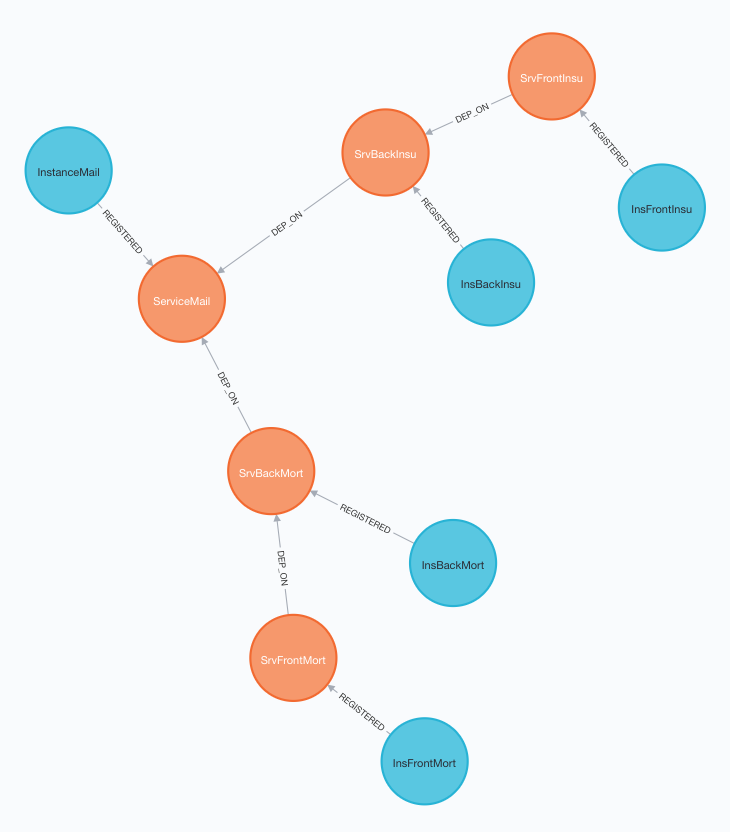

# Visualisation of AWS Cloudmap services with NEO4J




## Context
[*AWS Cloud Map Service Discovery*](https://aws.amazon.com/cloud-map/) is a great way to implement service discovery and to have an overview of live services and instances.
This PoC takes CloudMap a step further and aims to visualize the services and the dependencies between them by using [*Neo4j*](https://neo4j.com).

Neo4j is a NOSQL graph database that allows us to easily visualize information and relations. 

## Approach
Instead of processing each change in Cloudmap and try to reflect it in the Neo4j database, we take a 'snapshot' of the whole Cloudmap content, update the Neo4j database and remove obsolete services, instances and relations. 

The flow is as follows:
CloudMap -> Producer -> SQSQueue -> Consumer -> Neo4j database

The Producer creates a payload of all services and instances and put's it in a message on the Queue.
The Consumer processes 1 message at a time and uses the message id to mark each node in neo4j when it updates or creates nodes.
To make sure this transaction is atomic, we've implemented single concurrency for the Neo4j database, that is, only 1 transaction can be executed at a time.
This is done through a locking mechanism with DynamoDB. 
The last thing that the Consumer does is remove nodes that does not have the current message id, effectively creating a representation of Cloudmap. 

## Missing features
### Automatic trigger between Cloudmap and the Producer
The Producer Lambda function must be invoked manually, because the Cloudwatch rule is not implemented yet.  

### Neo4j
The repository does not have a Neo4j service yet, you'll have to run it yourself.

## How to install
In the following order:

### 1 - CloudMap
- Create a CloudMap API namespace
- Use the cloudmap-example SAM template in this repo to deploy example services and instances
- If you want to have a relationship between services, create a tag 'NEO4J_RELATIONSHIP_TO_SERVICE' on the service with the name of the other service as the value.


### 2 - Neo4j database
- Run a neo4j:3.5 container publicly, for example on Kubernetes or AWS ECS. Note the exposed ip address / dns name.
- Expose the default ports
- Go to the browser interface and reset the password
- In the Cypher query interface, create a constraint on 'Service' node:
```
CREATE CONSTRAINT ON (n:Service) ASSERT n.name IS UNIQUE
```

### Deploy the stack
Deploy the SAM template which will deploy:
- Producer lambda function
- SQS queue
- Consumer lambda function
- DynamoDB table 

## How to use
Manually invoke the Producer lambda function. This will put a message with a Cloudmap content payload on the queue.
The Consumer will pick up the message and execute a transaction against the Neo4j database.
To see the visualisation simply use the Neo4j Cypher query:
```
MATCH (n) RETURN n  
```


## Useful cypher queries
```
# generate graph
MATCH (n) RETURN n   

# delete all 
MATCH (n) DETACH DELETE n

# delete single node
MATCH (n:Resource { name: 'service-example' }) DELETE n

# unique
CREATE CONSTRAINT ON (n:Service) ASSERT n.name IS UNIQUE

```
